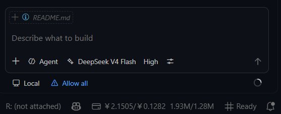
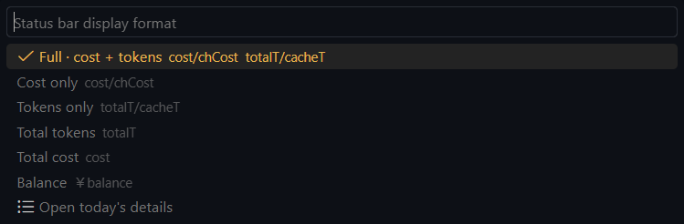
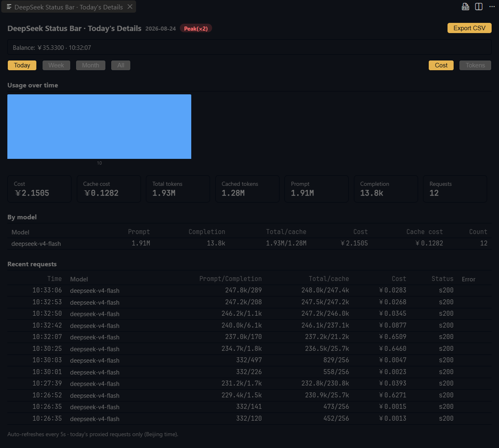

<h1 align="center">DeepSeek Status Bar for Copilot</h1>

<p align="center">
  <a href="https://marketplace.visualstudio.com/items?itemName=zxzxo.deepseek-status-bar-for-copilot"></a>
  <br/>
  
  
</p>

<p align="center">
  [English](README.md) · 简体中文
</p>

<p align="center">
  <strong>DeepSeek 在 Copilot 里到底花了你多少钱？状态栏实时显示，无需离开 VS Code。</strong>
</p>

本扩展在 Copilot Chat（经 [DeepSeek V4 for Copilot Chat](https://marketplace.visualstudio.com/items?itemName=Vizards.deepseek-v4-for-copilot) 扩展）与 DeepSeek API 之间架了一个轻量本地代理，捕获**每个响应里真实的 `usage` 对象**，换算成今日费用与词元总量——北京时间，含高峰计费。

<p align="center">
  
</p>

## 为什么选它？

- **真实数字，不是估算。** 读取 DeepSeek 每次请求返回的 `usage`（`prompt_tokens` / `completion_tokens` / 缓存词元），按官方价计价，总额与你账单一致——没有启发式估算。
- **常驻状态栏。** 一眼看到费用、缓存命中费用、总词元与缓存词元。点击可切换六种显示格式。
- **需要时是一块真正的仪表盘。** Webview 面板支持 `today / week / month / all` 区间、逐小时费用与词元图、按模型拆分、最近请求与 CSV 导出。
- **你的 API key 从不经过本扩展。** 代理把 `Authorization` 头原样转发给 DeepSeek；key 始终留在 Copilot 扩展存储它的地方。
- **零运行时依赖。** 纯 VS Code API + Node.js 内置模块。无 Python、无 Docker、无需额外服务。

## 它和别人的区别

市面上其他 DeepSeek 用量工具回答的是 *"账户还剩多少钱"*——它们轮询 [`/user/balance`](https://api.deepseek.com/user/balance) 显示余额。本扩展回答的是另一个问题：***"刚才那一问到底花了多少钱？"***

它处在**流量路径上**——一个本地代理，捕获 DeepSeek 每个响应返回的真实 `usage` 对象，用官方价目表计价：

- **真源，不是估算。** `usage` 正是 DeepSeek 计费的原始字段（`prompt_tokens` / `completion_tokens` / `cache_hit` / `cache_miss`），没有启发式词元估算。
- **三轴计价。** 缓存命中/未命中、输入/输出、北京高峰/低谷（×2）——与你的真实账单同轴。
- **被中断的生成也照常计费。** 中途取消时，代理继续读完上游直到捕获最终 `usage`——数字与你被扣的钱一致。
- **你的 API key 从不经过本扩展。** 代理只转发 `Authorization` 头，从不存储。

## 功能

### 实时状态栏

状态栏显示今日（北京时间）合计并自动刷新：

<p align="center">
  
</p>

- **费用** —— `￥9.8626/4.4522` 总费用/缓存命中费用
- **词元** —— `91.69M/89.04M` 总词元/缓存词元
- **余额** —— `￥xx.xx` 账户余额，随每次请求由代理刷新
- **高峰计费感知** —— 高峰时段（北京时间工作日 09:00–12:00、14:00–18:00）费用 ×2
- **六种显示格式** —— 点击状态栏切换：`full`（费用+词元）、`cost`、`tokens`、`totalT`（仅总词元）、`totalCost`（仅总费用）或 `balance`（余额）
- **低余额告警** —— 余额低于 `deepseekUsage.lowBalanceWarnCny` 时状态栏变琥珀色

### 明细面板

点击进入完整 Webview 仪表盘：

<p align="center">
  
</p>

- **区间选择** —— `today` / `week`（最近 7 天）/ `month`（最近 30 天）/ `all`
- **用量走势图** —— 费用或词元，今天按**小时**分桶，更长区间按**天**分桶
- **按模型拆分** —— 各模型（Flash / Pro / Vision）的费用与词元
- **最近请求** —— 时间、模型、输入/输出、总/缓存词元、费用、状态
- **导出 CSV** —— 将所选区间导出为带费用列的 CSV

### 真流式代理

一个本地 OpenAI 兼容代理，真流式转发 `chat/completions`：

- **分块流式透传** —— 响应边到边转给 Copilot，不缓冲
- **SSE 安全** —— 处理跨网络边界拆开的 usage 块
- **断连安全** —— 客户端取消时继续读上游以捕获最终 `usage`（被中断的生成照样计费、照样入账）
- **自动启动** —— 随 VS Code 启动（`autoStart`），接管 `deepseek-copilot.baseUrl`，停止时恢复

### 账户余额（随请求查询）

代理每次转发时手里本就有你的 key，于是顺带查询 [`/user/balance`](https://api.deepseek.com/user/balance)，在状态栏与面板显示余额：

- **无需额外配置 key** —— key 只在请求过程中使用，从不落盘
- **节流** —— 每分钟最多一次；遇 HTTP 402 时立即强制查询
- **402 感知** —— 余额不足的响应会在明细面板标出，并附带一次即时余额查询

### 可配置定价与货币

- **定价覆盖** —— 内置价目表（按模型、元/百万词元）可按模型在设置里覆盖
- **CNY / USD 显示** —— 一个设置切换货币；USD 使用公开 API 拉取的实时汇率，离线时回退到可配置汇率
- **语言** —— 界面跟随 VS Code 显示语言（简体中文 / English）

## 工作原理

```
Copilot Chat (DeepSeek V4 for Copilot)
        │  baseUrl → http://127.0.0.1:8080
        ▼
  本地代理 (Node.js，由本扩展拉起)
        │  带上你的 Authorization 头转发
        ▼
  api.deepseek.com
        │  捕获 response.usage
        ▼
  usage.jsonl  →  状态栏 + 明细面板（展示时计价）
```

数据以"每次请求一行 JSON"的形式存在 VS Code 全局存储里：只存事实（UTC 时间戳 + 词元数）。费用在**展示时**计算，因此改价格或货币会立即生效——无需重算历史。

## 快速开始

### 前置条件

- **VS Code 1.85** 或更高
- **DeepSeek V4 for Copilot Chat** —— 作为本扩展的依赖自动安装
- 在扩展里配置好 **DeepSeek API key**（本扩展完全看不到它）

### 安装

1. 从 [VS Code 市场](https://marketplace.visualstudio.com/items?itemName=zxzxo.deepseek-status-bar-for-copilot) 安装（或从源码构建，见下文）。
2. 重载 VS Code。代理自动启动。

### 使用

1. 打开 Copilot Chat，选择 DeepSeek V4 模型（配套扩展）。
2. 正常聊天——状态栏开始显示今日费用与词元。
3. 点击状态栏切换格式，或运行 **DeepSeek Status Bar: Today's Details** 打开完整面板。

## 设置

| 设置项 | 默认 | 说明 |
|---|---|---|
| `deepseekUsage.port` | `8080` | 本地代理监听端口 |
| `deepseekUsage.autoStart` | `true` | VS Code 启动时自动拉起代理 |
| `deepseekUsage.manageBaseUrl` | `true` | 运行期间把 `deepseek-copilot.baseUrl` 指向代理，停止时恢复 |
| `deepseekUsage.pollIntervalSeconds` | `10` | 状态栏刷新间隔（秒，最小 2） |
| `deepseekUsage.statusBarFormat` | `full` | 状态栏格式：`full` / `cost` / `tokens` / `totalT` / `totalCost` / `balance` |
| `deepseekUsage.pricing` | `{}` | 按模型定价覆盖（元/百万词元）：`{"deepseek-v4-flash": {"cache_hit": 0.05, "cache_miss": 1.5, "output": 4.5}}` |
| `deepseekUsage.currency` | `cny` | 费用货币：`cny`（￥）或 `usd`（$） |
| `deepseekUsage.cnyPerUsd` | `6.74` | CNY 兑 USD 的兜底汇率（实时汇率拉取失败时用） |
| `deepseekUsage.lowBalanceWarnCny` | `10` | 余额（元）低于该值时状态栏告警；`0` 关闭 |

**计价模型** —— 内置默认价 + 你的覆盖；北京工作日 09:00–12:00、14:00–18:00 高峰 = 低谷 ×2。USD 显示使用实时汇率（公开 API，每 6 小时刷新），离线回退到 `cnyPerUsd`。

## 命令

| 命令 | 说明 |
|---|---|
| `DeepSeek Status Bar: Today's Details` | 打开明细面板 |
| `DeepSeek Status Bar: Start Proxy` / `Stop Proxy` | 启停代理（面板条目随当前状态切换） |
| `DeepSeek Status Bar: Display Format` | 选择状态栏显示格式 |

## 注意事项与限制

- **不计 vision 请求。** 配套扩展的 vision 功能走独立的 `/v1/responses` 端点，独立于 `baseUrl` 配置，不经过本代理。
- **`baseUrl` 是全局的。** 接管 `deepseek-copilot.baseUrl` 会影响所有窗口。代理停止时会恢复，但若 VS Code 被强杀，该值可能残留指向代理——下次启动时因 `autoStart` 开启会自动恢复。
- **以官方后台为准。** 费用按同一计价模型计算，但计费请始终以 `platform.deepseek.com` 为准。

## 从源码构建

```powershell
npm install
npm run compile      # 或 npm run watch
npm run typecheck
npm run smoke

# 打包为 .vsix
powershell -ExecutionPolicy Bypass -File .\package.ps1

# 安装 / 重装（--force 覆盖同版本）
code --install-extension .\deepseek-status-bar-for-copilot.vsix --force
```

## 许可证

[MIT](LICENSE)
